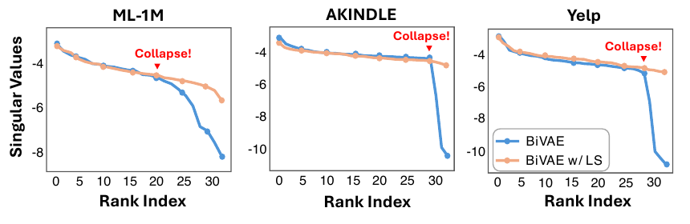

<div align="center">

# Rethinking Overconfidence in VAEs: Can Label Smoothing Help?

**[Woo-Seong Yun](https://scholar.google.com/citations?user=ZRXyvtMAAAAJ)**\* &nbsp;·&nbsp; **Yeo-Jun Choi**\* &nbsp;·&nbsp; **Yoon-Sik Cho**

<sub>Department of Artificial Intelligence, Chung-Ang University</sub>

*RecSys 2025 (19th ACM Conference on Recommender Systems), pp. 666–670, Prague, Czech Republic*

[](https://dl.acm.org/doi/10.1145/3705328.3748039)
[](https://www.python.org/)
[](https://pytorch.org/)
[](https://creativecommons.org/licenses/by-nc-nd/4.0/)

</div>

This is the PyTorch implementation for our RecSys 2025 paper:

> Rethinking Overconfidence in VAEs: Can Label Smoothing Help? (RecSys, 2025)

<p align="center">
  
</p>

## Overview

VAE-based collaborative filtering models are competitive, but they grow overconfident during training, and extreme sparsity plus implicit feedback push the predicted scores of almost all user–item pairs toward zero. We show, theoretically and empirically, that this overconfidence vanishes the reconstruction gradients and causes *embedding collapse*, where user and item embeddings fall into a low-rank subspace. To fill this gap, we study label smoothing (LS) in VAE-based CF: smoothing the interaction matrix gives the loss a strictly positive lower bound on negatives, which keeps gradients alive and prevents collapse. Applied to PoisVAE, BiVAE and DualVAE, LS improves every metric on ML-1M, AKindle and Yelp with up to 15% relative gains, and the optimal smoothing factor decreases with data sparsity.

## Requirements

```bash
conda create -n rethink python=3.8.20
conda activate rethink
pip install cornac==1.18.0
pip install torch==2.0.0 torchvision==0.15.1 torchaudio==2.0.1 --index-url https://download.pytorch.org/whl/cu118/
pip install pandas==2.0.3
```

## Datasets

We follow the data split of [DualVAE](https://github.com/georgeguo-cn/DualVAE): 20-core for ML-1M and 10-core for AKindle and Yelp. Preprocessed train/test splits are included under `data/`.

| Dataset | Users | Items | Interactions | Sparsity |
| --- | ---: | ---: | ---: | ---: |
| ML-1M | 6,040 | 3,679 | 1,000,180 | 0.9550 |
| AKindle | 14,356 | 15,885 | 367,477 | 0.9984 |
| Yelp | 31,668 | 38,048 | 1,561,406 | 0.9987 |

## Training

To train DualVAE with label smoothing using the smoothing factor selected for each dataset:

```bash
python main.py -d ML1M    -ne 500 -k 20 -ls 0.05
python main.py -d AKindle -ne 500 -k 20 -ls 0.001
python main.py -d Yelp    -ne 200 -k 20 -ls 0.0005
```

Set `-ls 0.0` to reproduce the baseline without label smoothing. `train.sh` runs all six configurations.

## Results

Bold marks the better of each pair and underline the previous state of the art (Table 2 of the paper). All improvements are statistically significant (p < 0.05).

| Model | ML-1M<br>R@20 | ML-1M<br>N@20 | AKindle<br>R@20 | AKindle<br>N@20 | Yelp<br>R@20 | Yelp<br>N@20 |
| --- | ---: | ---: | ---: | ---: | ---: | ---: |
| Mult-VAE | 0.2301 | 0.3378 | 0.0754 | 0.0479 | 0.0518 | 0.0417 |
| MacridVAE | <u>0.2313</u> | 0.3409 | 0.0779 | 0.0475 | 0.0601 | 0.0485 |
| PoisVAE | 0.2273 | 0.3442 | 0.0623 | 0.0392 | 0.0563 | 0.0459 |
| &nbsp;&nbsp;+ LS | **0.2347** | **0.3570** | **0.0652** | **0.0397** | **0.0581** | **0.0476** |
| BiVAE | 0.2305 | 0.3450 | 0.0763 | 0.0479 | 0.0584 | 0.0477 |
| &nbsp;&nbsp;+ LS | **0.2359** | **0.3658** | **0.0873** | **0.0552** | **0.0608** | **0.0489** |
| DualVAE | 0.2299 | <u>0.3535</u> | <u>0.0812</u> | <u>0.0512</u> | <u>0.0610</u> | <u>0.0499</u> |
| &nbsp;&nbsp;+ LS | **0.2474** | **0.3813** | **0.0886** | **0.0566** | **0.0657** | **0.0537** |

## Citation

If you find this work useful, please cite:

```bibtex
@inproceedings{yun2025rethinking,
  title     = {Rethinking Overconfidence in VAEs: Can Label Smoothing Help?},
  author    = {Woo-Seong Yun and YeoJun Choi and Yoon-Sik Cho},
  booktitle = {Proceedings of the Nineteenth ACM Conference on Recommender Systems},
  series    = {RecSys '25},
  pages     = {666--670},
  year      = {2025},
  publisher = {ACM},
  doi       = {10.1145/3705328.3748039}
}
```

## Acknowledgements

This work was partly supported by the National Research Foundation of Korea (NRF) grant funded by the Korea government (MSIT) (RS-2025-00553785) and the Institute of Information & Communications Technology Planning & Evaluation (IITP) grant funded by the Korean government (MSIT) (RS-2021-II211341, Artificial Intelligence Graduate School Program of Chung-Ang University).

Our implementation builds on [DualVAE](https://github.com/georgeguo-cn/DualVAE) and [Cornac](https://github.com/PreferredAI/cornac).
